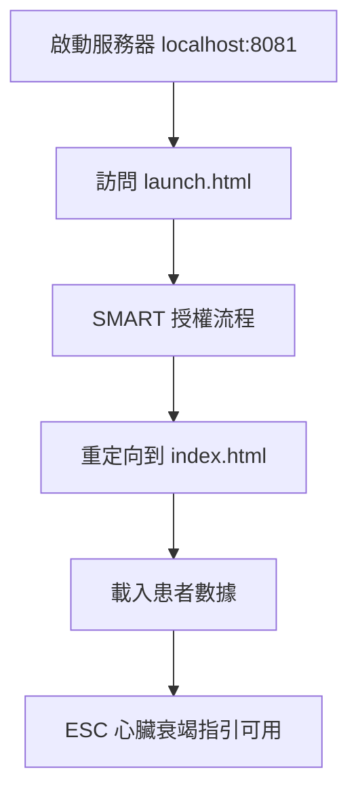

# 🛡️ Web Crypto API 安全上下文錯誤解決方案

## 問題描述
```
Error: Some of the required subtle crypto functionality is not available 
unless you run this app in secure context (using HTTPS or running locally)
```

這個錯誤出現是因為 **Web Crypto API** 需要在**安全上下文**中運行，而 SMART on FHIR 客戶端庫使用了這些加密功能。

## 🚀 解決方案（按推薦順序）

### 方案 1：使用正確的 localhost 地址 ⭐ (最推薦)

**確保使用 `localhost` 而不是 IP 地址：**

```bash
# ✅ 正確的啟動方式
npm run dev-cors
# 或
npx http-server -p 8081 -c-1 -o --cors

# ✅ 正確的訪問地址
http://localhost:8081/launch.html?iss=https://r4.smarthealthit.org

# ❌ 錯誤的訪問地址
http://127.0.0.1:8081/launch.html  # 某些瀏覽器可能不認為這是安全上下文
http://192.168.1.102:8081/launch.html  # IP地址不是安全上下文
```

### 方案 2：使用 Windows 啟動腳本

雙擊執行 `start-secure.bat` 文件，這會：
- 自動檢查端口可用性
- 啟動正確配置的服務器
- 提供完整的操作指導

### 方案 3：使用 HTTPS（生產環境推薦）

```bash
# 如果您有 SSL 證書
npm run dev-secure

# 使用 Ngrok 創建 HTTPS 隧道
ngrok http 8081
# 然後使用 ngrok 提供的 HTTPS URL
```

### 方案 4：瀏覽器設置（臨時方案）

**Chrome：**
```bash
# 啟動 Chrome 並禁用安全檢查（僅限開發）
chrome.exe --disable-web-security --disable-features=VizDisplayCompositor --user-data-dir=temp
```

**Firefox：**
- 在地址欄輸入 `about:config`
- 搜索 `dom.webidl.webauth.enabled`
- 設置為 `false`（不推薦，僅限測試）

## 🔧 故障排除

### 檢查清單

1. **確認訪問地址**
   ```
   ✅ http://localhost:8081
   ❌ http://127.0.0.1:8081
   ❌ http://192.168.1.102:8081
   ```

2. **確認服務器啟動**
   ```bash
   # 檢查服務器是否運行
   netstat -an | findstr ":8081"
   ```

3. **檢查瀏覽器控制台**
   - 按 F12 開啟開發者工具
   - 查看 Console 頁籤的錯誤訊息
   - 查看 Network 頁籤的請求狀態

### 常見錯誤及解決方案

| 錯誤 | 原因 | 解決方案 |
|------|------|----------|
| `subtle crypto functionality not available` | 非安全上下文 | 使用 localhost 或 HTTPS |
| `EADDRINUSE: address already in use` | 端口被佔用 | 更換端口或關閉佔用程序 |
| `CORS error` | 跨域請求被阻擋 | 啟動時添加 `--cors` 參數 |

## 🧪 測試步驟

### 完整測試流程

1. **啟動服務器**
   ```bash
   npm run dev-cors
   ```

2. **測試基本功能**
   - 訪問：`http://localhost:8081`
   - 確認頁面正常加載

3. **測試 SMART 啟動**
   - 訪問：`http://localhost:8081/launch.html?iss=https://r4.smarthealthit.org`
   - 觀察是否出現 Web Crypto API 錯誤

4. **使用 SMART Health IT Launcher**
   - 前往：https://launch.smarthealthit.org/
   - App Launch URL：`http://localhost:8081/launch.html`
   - 選擇患者並啟動

## 🏥 正確的 SMART on FHIR 流程



## 📞 額外支援

如果上述方案都無法解決問題：

1. **檢查瀏覽器版本**
   - Chrome 90+, Firefox 88+, Safari 14+, Edge 90+

2. **檢查系統環境**
   - Node.js 14+
   - 網路連接正常

3. **聯繫支援**
   - 提供瀏覽器控制台的完整錯誤訊息
   - 說明使用的啟動方式和訪問地址

---

## 🎯 最佳實踐建議

- **開發環境**：使用 `localhost` + HTTP
- **測試環境**：使用 HTTPS + 有效證書
- **生產環境**：必須使用 HTTPS
- **部署時**：更新所有 redirect_uri 為 HTTPS 地址

記住：安全上下文要求是為了保護用戶數據，雖然在開發時可能帶來不便，但這是必要的安全措施。 